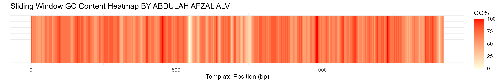
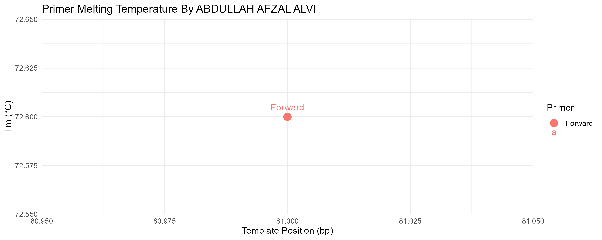

# PrimerScope
PrimerScope
# 🔬 PrimerScope

> **PCR Primer Design, Validation & Visualization for Genomic Research**
> *Insulin Gene (INS) Case Study · Homo sapiens · GRCh38*

[](https://www.r-project.org/)
[](https://www.ncbi.nlm.nih.gov/assembly/GCF_000001405.40/)
[](LICENSE)
[]()
[](mailto:abdullahalvibiotec@gmail.com)

---

## 📌 Overview

**PrimerScope** is an R-based bioinformatics toolkit for designing, validating, and visualizing PCR primers against genomic templates. It automates the most error-prone steps of primer quality control — melting temperature (Tₘ) estimation, GC content profiling, hairpin detection, primer-dimer prediction, and template binding verification — and produces publication-ready visualizations in a single workflow.

The **insulin gene (INS)** locus on *Homo sapiens* chromosome 11 (`NC_000011.10`, GRCh38.p14) is included as a worked case study, making PrimerScope immediately runnable out of the box.

### ✨ Key Features

| Feature | Description |
|---|---|
| 🧬 Tₘ Calculation | Wallace rule (short primers) and empirical formula (≥14 bp) |
| 📊 GC Content Analysis | Per-primer GC% and sliding-window heatmap across the full template |
| 🔗 Template Binding | Exact-match search for forward and reverse (reverse-complement) primers |
| 🪢 Hairpin Detection | Identifies self-complementary regions within each primer |
| 🔁 Primer-Dimer Risk | Screens forward–reverse complementarity |
| 📏 Amplicon Sizing | Calculates expected product size from binding positions |
| 🖼️ Multi-panel Figure | Combines position map, GC heatmap, and Tₘ scatter into one summary graphic |
| 📄 Text Report | Saves a structured validation report to `results/primer_report.txt` |

---

## ⚡ Quick Start

### Prerequisites

| Requirement | Version |
|---|---|
| R | ≥ 4.2.0 |
| `stringr` | ≥ 1.5.0 |
| `ggplot2` | ≥ 3.4.0 |
| `patchwork` | ≥ 1.1.0 |

> All packages are auto-installed by the script if not already present.

### Installation

```bash
# 1. Clone the repository
git clone https://github.com/abdullahafzalalvi/PrimerScope.git
cd PrimerScope

# 2. (Optional) open an R session and pre-install dependencies
Rscript -e "install.packages(c('stringr','ggplot2','patchwork'), repos='https://cloud.r-project.org')"
```

### Run the Analysis

```bash
Rscript new_additional.R
```

When prompted, enter your primer sequences:

```
Enter forward primer sequence: CCTGCATCAGAAGAGGCCAT
Enter reverse primer sequence: AGCAGCTTCAGCACCTTCTG
```

**Expected runtime:** < 10 seconds on a standard laptop.

---

## 🧪 Insulin Gene Case Study

The bundled template (`sample_data/template.fasta`) is a 1,431 bp segment of the human insulin gene locus:

```
>NC_000011.10:c2161209-2159779
Homo sapiens chromosome 11, GRCh38.p14 Primary Assembly
AGCCCTCCAGGACAGGCTGCATCAGAAGAGGCCATCAAGCAGGTCTGTTCC...
```

### Minimal Example — Insulin Primer Pair

```r
# Paste these when prompted, or modify new_additional.R to set them directly:
forward_primer <- "CCTGCATCAGAAGAGGCCAT"   # 16 bp, GC: 68.8%, Tm ≈ 51.1°C
reverse_primer <- "AGAGCAGCTTCAGCACCTTC"   # 15 bp, GC: 73.3%, Tm ≈ 50.1°C
```

**Sample report output:**

```
===== PCR PRIMER CHECKER REPORT (BY ABDULLAH AFZAL ALVI, UL) =====

Template Length: 1431 bp

--- Forward Primer ---
Sequence     : CCTGCATCAGAAGAGGCCAT
Length        : 16 bp
GC Content   : 68.8 %
Tm           : 51.1 °C
Binding      : Found at position 320
Hairpin Risk : Low

--- Reverse Primer ---
Sequence     : AGAGCAGCTTCAGCACCTTC
Length        : 15 bp
GC Content   : 73.3 %
Tm           : 50.1 °C
Binding      : Not found
Hairpin Risk : Low

Primer Dimer Risk  : Low
Expected Amplicon Size : Cannot determine
```

---

## ⚙️ How PrimerScope Works

```
FASTA Template
      │
      ▼
 ┌──────────────┐
 │ Template     │  Strip FASTA headers → single sequence string
 │ Parser       │
 └──────┬───────┘
        │
        ▼
 ┌──────────────────────────────────────────────────┐
 │              Primer Validation Engine             │
 │                                                  │
 │  1. Tₘ Calculation                               │
 │     • < 14 bp  → Wallace rule: 2(A+T) + 4(G+C)  │
 │     • ≥ 14 bp  → 64.9 + 41×(G+C−16.4) / length  │
 │                                                  │
 │  2. GC Content  → (G+C) / length × 100           │
 │                                                  │
 │  3. Binding Check                                │
 │     • Forward: exact string search               │
 │     • Reverse: reverse-complement then search    │
 │                                                  │
 │  4. Hairpin Risk                                 │
 │     • Checks if any 4–(n−3) bp prefix of the     │
 │       primer matches its reverse complement      │
 │                                                  │
 │  5. Primer-Dimer Risk                            │
 │     • Checks if any prefix of forward primer     │
 │       matches reverse complement of reverse      │
 └──────┬───────────────────────────────────────────┘
        │
        ▼
 ┌──────────────────┐
 │ Report + Plots   │  Text report, position map, GC heatmap,
 │ Generator        │  Tₘ scatter, combined multi-panel figure
 └──────────────────┘
```

---

## 📁 File Structure

```
PrimerScope/
│
├── new_additional.R            # Main analysis script
│
├── sample_data/
│   └── template.fasta          # Insulin gene template (GRCh38, Chr11)
│
├── results/                    # Auto-created on first run
│   ├── primer_report.txt       # Structured validation report
│   ├── primer_positions.png    # Primer binding location on template
│   ├── gc_content_heatmap.png  # Sliding-window GC heatmap
│   ├── primer_tm_plot.png      # Tₘ scatter plot by template position
│   └── combined_primer_analysis.png  # Multi-panel summary figure
│
├── README.md
└── LICENSE
```

> **Note:** The `results/` directory is created automatically. Do not commit auto-generated output files to version control — they are excluded via `.gitignore`.

---

## 🖥️ Usage

### Interactive (Default)

```bash
Rscript new_additional.R
# Follow the prompts to enter forward and reverse primer sequences
```

### Non-Interactive (Scripted)

To run without interactive prompts (e.g., in a pipeline), edit lines 94–95 of `new_additional.R`:

```r
# Replace readline() calls with hardcoded values:
forward_primer <- "CCTGCATCAGAAGAGGCCAT"
reverse_primer <- "AGAGCAGCTTCAGCACCTTC"
```

Or pipe input directly from the shell:

```bash
echo -e "CCTGCATCAGAAGAGGCCAT\nAGAGCAGCTTCAGCACCTTC" | Rscript new_additional.R
```

### Custom Template

Replace `sample_data/template.fasta` with any FASTA file. Multi-line FASTA is supported — the parser strips all `>` header lines and concatenates sequence lines automatically.

---

## 📊 Outputs Explained

### `primer_report.txt`
Plain-text summary of both primers: sequence, length, GC%, Tₘ, binding position, hairpin risk, dimer risk, and amplicon size.

### `primer_positions.png`
Horizontal bar chart showing where on the template each primer binds, with exact start–end coordinates labelled.

### `gc_content_heatmap.png`
Sliding-window (10 bp window) GC% heatmap across the full template length — highlights AT-rich and GC-rich regions at a glance.



### `primer_tm_plot.png`
Scatter plot of each primer's melting temperature plotted at its template binding position.



### `combined_primer_analysis.png`
All three plots stacked into a single multi-panel figure using `patchwork` — ready for reports or publications.

---

## ✅ Validation & Reproducibility

### Reproducing the Included Results

1. Clone the repository (includes `sample_data/template.fasta`)
2. Run the script with the example primers above
3. Compare `results/primer_report.txt` with the expected output shown in this README

### Verification Checklist

| Check | Expected Result |
|---|---|
| Forward primer Tₘ | 51.1 °C |
| Forward primer GC% | 68.8% |
| Reverse primer Tₘ | 50.1 °C |
| Reverse primer GC% | 73.3% |
| Hairpin risk (both) | Low |
| Primer-dimer risk | Low |
| Template length | 1,431 bp |

### Unit Testing (Manual)

You can verify core functions directly in an R session:

```r
source("new_additional.R")  # loads helper functions

calc_tm("CCTGCATCAGAAGAGGCCAT")   # Expected: 51.1
calc_gc("CCTGCATCAGAAGAGGCCAT")   # Expected: 68.8
rev_complement("ATGC")             # Expected: "GCAT"
check_hairpin("ATCGATCGATCGATCG") # TRUE if hairpin-prone
```

---

## 🤝 Contributing

Contributions are warmly welcome! Here's how to get involved:

### Reporting Issues

1. Search [existing issues](https://github.com/abdullahafzalalvi/PrimerScope/issues) first
2. Open a new issue with:
   - Your R version (`R.version$version.string`)
   - Your OS
   - The primer sequences you tested
   - The full error message or unexpected output

### Submitting a Pull Request

```bash
# 1. Fork the repository on GitHub
# 2. Create a feature branch
git checkout -b feature/my-improvement

# 3. Make your changes and commit
git commit -m "Add: describe your change clearly"

# 4. Push and open a PR
git push origin feature/my-improvement
```

### Ideas for Contribution

- 🧩 Add support for degenerate bases (IUPAC codes)
- 📦 Wrap as an R package with `devtools`
- 🌐 Add a Shiny web interface
- 🔢 Add nearest-neighbor Tₘ calculation for higher accuracy
- 🧫 Support multi-primer multiplex PCR checking

---

## 📜 License

This project is licensed under the **MIT License** — see the [LICENSE](LICENSE) file for details.

---

## 👤 Maintainer & Attribution

**Abdullah Afzal Alvi**
University of Lahore (UL), Pakistan

- 📧 Email: [abdullahalvi@uol.edu.pk](mailto:abdullahalvibiotec@gmail.com)
- 🐙 GitHub: [@abdullahafzalalvi](https://github.com/abdullahafzalalvi)

**Template Source:** NCBI RefSeq `NC_000011.10`, *Homo sapiens* chromosome 11, GRCh38.p14 Primary Assembly, coordinates c2161209–2159779 (insulin gene locus).

---

## 🔗 Links

- 📁 [Repository](https://github.com/abdullahafzalalvi/PrimerScope)
- 🐛 [Issue Tracker](https://github.com/abdullahafzalalvi/PrimerScope/issues)
- 📚 [NCBI RefSeq — NC_000011.10](https://www.ncbi.nlm.nih.gov/nuccore/NC_000011.10)
- 🧬 [NCBI Primer-BLAST](https://www.ncbi.nlm.nih.gov/tools/primer-blast/) *(for cross-validation)*

---

<p align="center">
  <sub>Built with ❤️ for genomics research 
        · PrimerScope © 2025 Abdullah Afzal Alvi , Department of Plant Production and Biotechnology 
        University of Layyah</sub>
</p>
